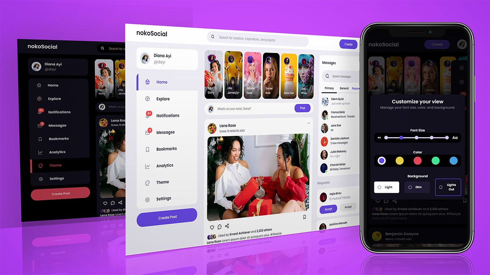

#How To Create A Responsive Social Media Website With Theme Customization Using HTML CSS & JavaScript

Hello guys, and welcome to another beginner web development project tutorial. Today we're going to create a responsive social media website with theme customization using HTML CSS & JavaScript. We'll use modern CSS features like CSS Variables, CSS Grid, CSS Flexbox and CSS Units like rem, vw and vh to achieve a Responsive Design.

###[Watch Video](https://youtu.be/AiFfDjmd0jU) On YouTube

